## Housekeeper Web Application

### Problem Statement : 
Design an application which hostel students can use to get their rooms cleaned on time. The current management system found it difficult to schedule cleaning services as students have varying class schedules which resulted in improper utilization of hostel room cleaning services.

### The project is divided into 3 segments
1. Database Schema Design
2. Frontend of Web App
3. Backend of Web App

#### Please find all source code in this repository.
----

### The following is the ER diagram made with the help of problem statement

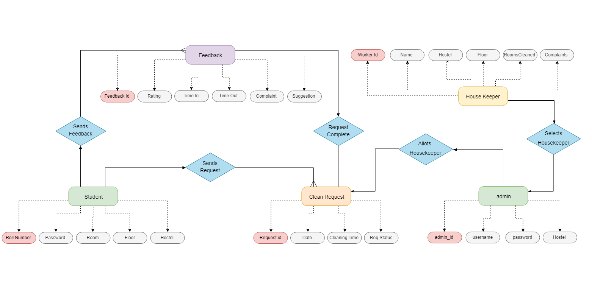

-------

### The Following is the database schema after Normalization of tables

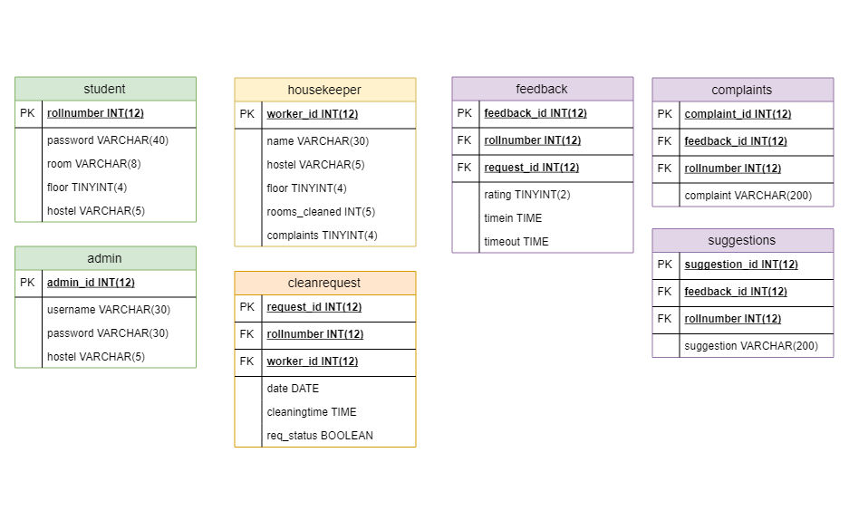

--------------

### Frontend Screens - User level
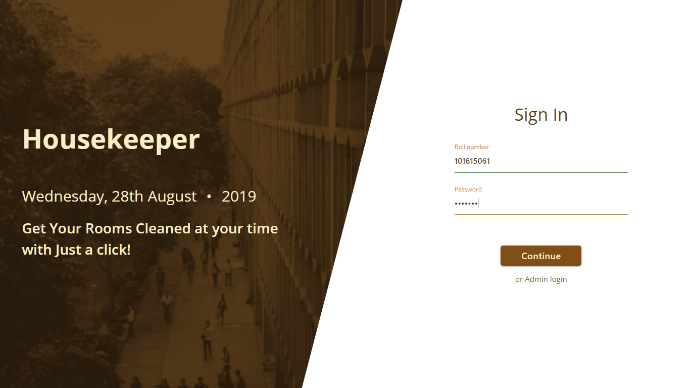

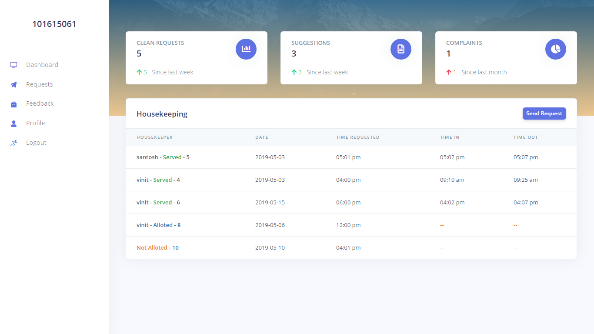

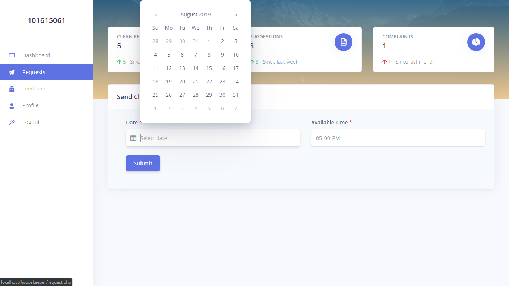

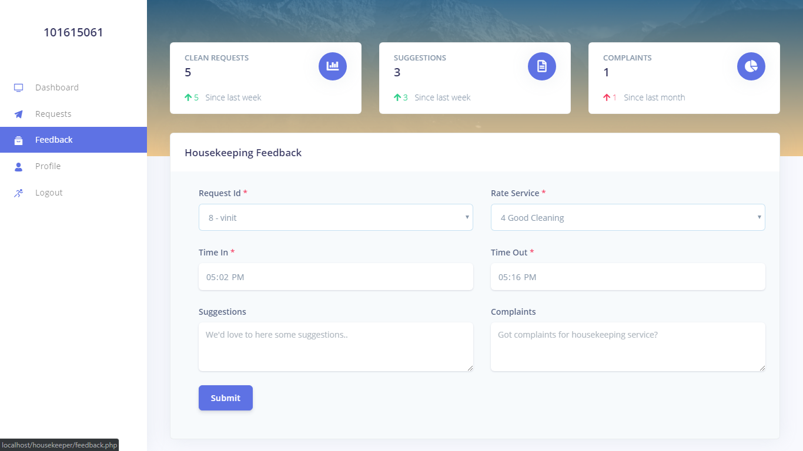

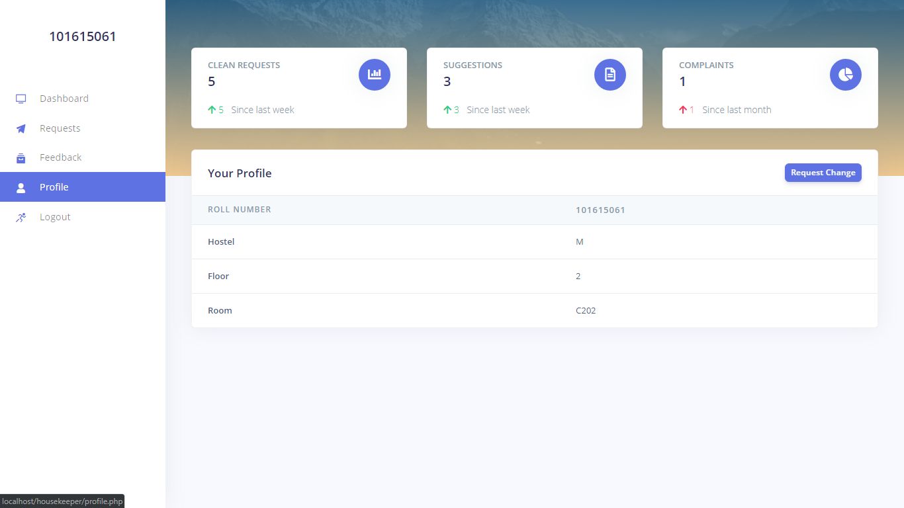

--------------

### Frontend Screens - Admin level

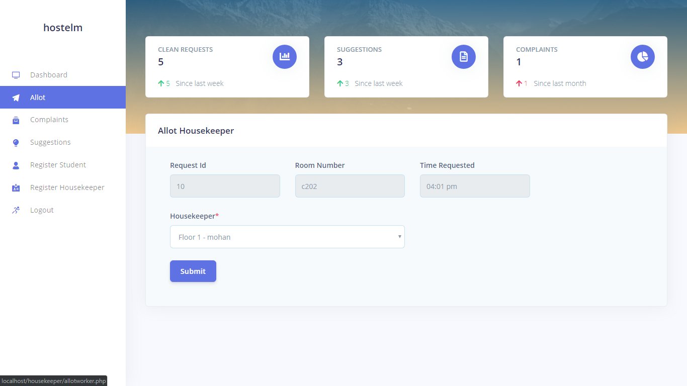

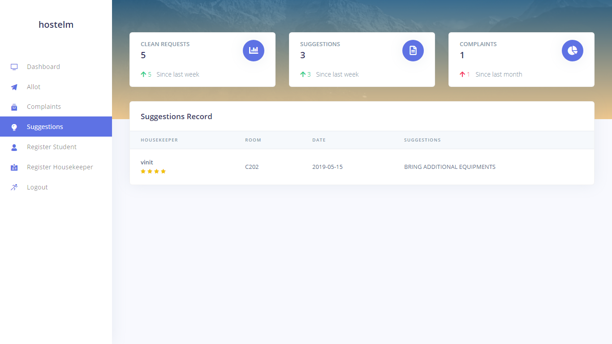

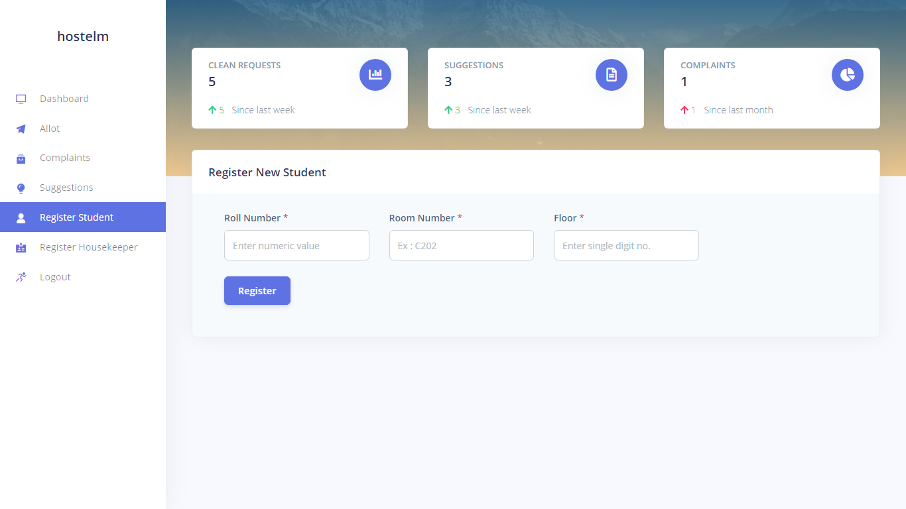

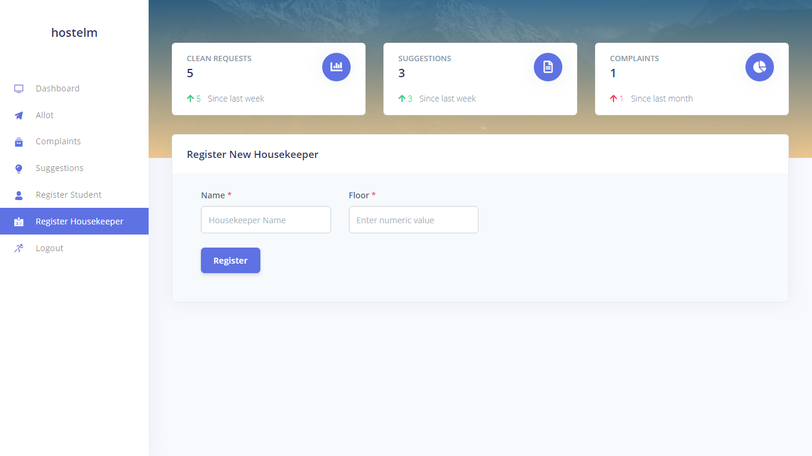

------------------------
